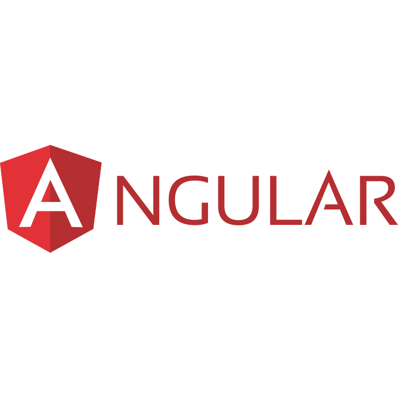

# MultiStepForm
**Sample preview**

## About the app
A form application with beautiful and well thought out interface. Highly interactive and easy to navigate based on your choice.

### Live host
The link to the site can be access by a click on this [**button**](https://multi-step-form-beta-five.vercel.app/) 👈

## Tech stack

## Local Development
- Clone or fork the repo. 
- Cd into the created directory or folder and open it with the preferred editor of your choice. 
- Run `npm install` to initialise your local development environment or workspace. 
- You can run `npm start` or `ng serve` to start your local server and play with the project. 

## Authors
### Jenef
- Summary component
- Thank you page

 ### Eric Obeng
 - FormDataService
 - Plan component UI and functionalities

## Paa Kwesi
- main multistep component
- Active step highlightt page on the left

